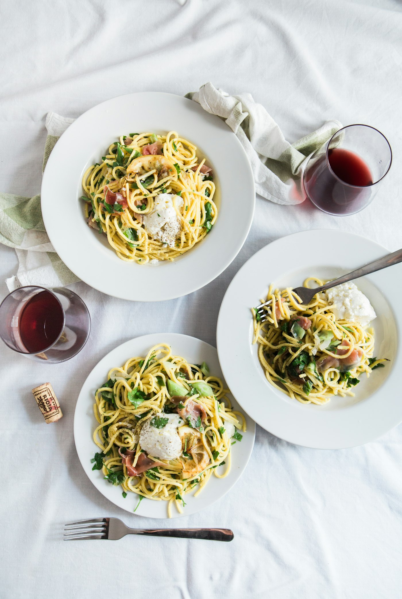

SNS에서 자주 보이던 그 집. 주말 11시에 갔는데 이미 이름을 적고 30분을 기다렸다.

## 맛

토스트 자체는 좋았다. 빵이 두껍고 겉은 바삭했다. 아보카도도 잘 익은 걸 써서, 으깬 식감이 부드러웠다. 위에 올린 반숙 달걀을 터뜨려 같이 먹으면 그게 제일 맛있다. 곁들여 시킨 것들도 같이 정리해 둔다.

<Gallery
  cols={2}
  caption="이날 시킨 메뉴들. 토스트, 샐러드, 사이드, 그리고 나눠 먹은 한 접시."
  images={[
    { src: './images/cover.jpg', alt: '반숙 달걀을 올린 아보카도 토스트' },
    { src: './images/salad.jpg', alt: '신선한 채소가 가득한 샐러드 한 그릇' },
    { src: './images/potato.jpg', alt: '바삭하게 구운 사이드 감자 요리' },
    {
      src: './images/share.jpg',
      alt: '여럿이 손을 뻗어 나눠 먹는 브런치 한 상',
    },
  ]}
/>

## 분위기

자리 간격이 넓고 채광이 좋아서, 사진 찍기엔 확실히 좋은 집이었다. 다만 사람이 많아 좀 시끄러운 편.

## 점수

- 맛: 4 / 5
- 분위기: 4.5 / 5
- 웨이팅 감수하고 또 갈지: 3 / 5

> 평일 오전이라면 웨이팅 없이 같은 걸 먹을 수 있다. 굳이 주말 피크에 갈 필요는 없었다는 게 솔직한 후기.
