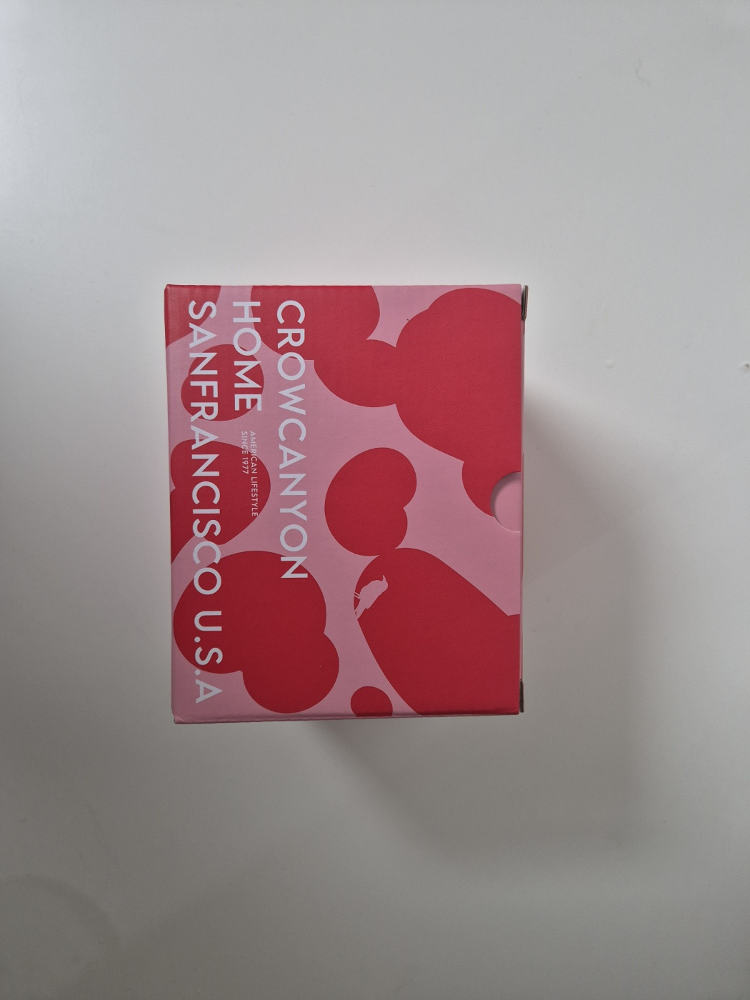

크로우캐년 홈 `K11 머그 그린스펙클` 하나를 받아서 언박싱해 봤다. 박스부터 색이 강하고, 꺼내 보니 **그린스펙클 무늬**가 생각보다 더 선명했다. 평범한 흰 머그보다 살짝 존재감 있는 컵을 찾는 사람이라면 한 번쯤 눈길이 갈 만한 제품이다.

<AdSlot slot="1406554779" className="my-6" />

## 크로우캐년 홈은 어떤 느낌인가

크로우캐년 홈(Crow Canyon Home)은 북부 캘리포니아 기반의 에나멜웨어 브랜드로 소개된다. 국내 공식몰 기준으로 이 제품은 `K11 머그 (5color)` 라인 중 `그린스펙클` 컬러에 해당한다. `스틴슨 12 oz speckle mugs`라는 공식 영문 설명도 함께 확인된다.

내가 받은 건 **초록 스펙클 계열**이라 첫인상이 꽤 산뜻했다. 사진으로 봤을 때보다 실물이 더 선명했고, 무늬도 단정하게 퍼져 있어서 부담스럽지 않았다.

## 박스 디자인

포장 박스는 **분홍색 바탕**에 진한 붉은 포인트가 들어가 있어서, 꺼내기 전부터 브랜드 톤이 분명하다. 로고도 큼직해서 선물용으로 봐도 심심하지 않다.

박스를 열면 안쪽은 비교적 담백하고, 그 안에서 컵이 바로 드러난다. 포장 자체가 복잡하지 않아서 오히려 제품 색이 더 잘 보였다.

## 실물은 이런 느낌

실물은 손에 쥐었을 때 부담이 적었다. **법랑 특유의 단단한 느낌**은 있지만, 디자인이 무겁게 느껴지진 않는다. 손잡이도 작게 불편하지 않은 정도라서 `데일리 컵`으로 쓰기 괜찮아 보였다.

안쪽에도 같은 스펙클 무늬가 이어져 있어서, 겉만 예쁜 타입이 아니라는 점이 마음에 들었다. 이런 제품은 책상 위에 두는 순간 분위기가 달라진다.

<Gallery
  cols={2}
  images={[
    {
      src: "./images/cover.jpeg",
      alt: "박스와 머그컵이 함께 보이는 크로우캐년 홈 언박싱 사진",
    },
    {
      src: "./images/mug-side.jpeg",
      alt: "그린스펙클 무늬가 보이는 크로우캐년 홈 머그 옆모습",
    },
    {
      src: "./images/mug-top.jpeg",
      alt: "머그 안쪽까지 스펙클 무늬가 들어간 크로우캐년 홈 컵 상단",
    },
    {
      src: "./images/mug-bottom.jpeg",
      alt: "크로우캐년 홈 로고가 찍힌 머그 바닥면",
    },
  ]}
/>

## 이런 사람에게 잘 맞는다

- **색감 있는 머그컵**을 찾는 사람
- **홈카페나 캠핑용 컵**을 같이 보는 사람
- **선물용으로 너무 평범하지 않은 소품**을 찾는 사람

무난한 흰 머그보다 조금 더 개성이 있는 컵을 원한다면 만족도가 높을 것 같다. 너무 튀는 느낌은 아니고, 책상 위에 올려두면 은근히 시선이 가는 정도다.

## 한 줄 정리

컵 자체보다 **책상 위 분위기를 정리하는 도구**에 가까운 제품이었다.  
색감 있는 법랑컵을 찾는다면 충분히 볼 만하다.

> 자극적인 향보다 조용한 분위기를 찾는다면 꽤 잘 맞는다.
