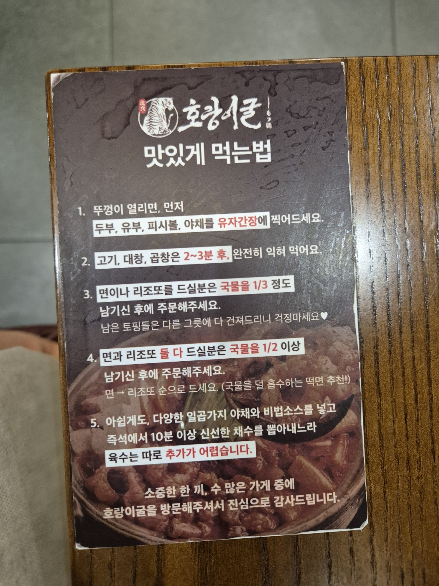

동탄 롯데백화점 지하 1층에 있는 호랑이굴에 갔다. `대창전골`로 유명한 집인데, 덮밥 형태의 정식 메뉴도 있어서 부담 없이 들를 수 있다.

<AdSlot slot="1406554779" className="my-6" />

## 호랑이굴 롯데백화점 동탄점 기본 정보

- 주소: 경기 화성시 동탄역로 160 지하 1층

### 운영시간

- 월: 10:30–20:00
- 화: 10:30–20:00
- 수: 10:30–20:00
- 목: 10:30–20:00
- 금: 10:30–20:30
- 토: 10:30–20:30
- 일: 10:30–20:30

<KakaoMap
  mapKey="pihbwo23dsd"
  timestamp="1781442432309"
  name="호랑이굴 롯데백화점동탄점"
/>

## 매장 분위기

백화점 지하에 있는데, 들어가면 분위기가 확 달라진다. 한지 소재 둥근 전등이 줄지어 달려 있고 짙은 나무 기둥으로 공간이 나뉘어 있어서 **일본 선술집 느낌**이 강하다. 벽에는 붓글씨 액자가 걸려 있고, 한쪽에는 아사히 생맥주 기계도 있다.
<Slideshow
  images={[
    {
      src: "./images/001.jpeg",
      alt: "흰 구형 전등과 나무 기둥이 줄지어 있는 호랑이굴 내부 전경",
    },
    {
      src: "./images/002.jpeg",
      alt: "입구 쪽 유리 파티션과 넓은 홀이 보이는 호랑이굴 매장 안쪽",
    },
    {
      src: "./images/003.jpeg",
      alt: "붓글씨 액자와 아사히 생맥주 기계가 있는 호랑이굴 좌석 공간",
    },
  ]}
/>

## 전골은 이렇게 먹는다더라

테이블에 저녁 전골 먹는 법 안내 카드가 있어서 읽어봤다.

뚜껑이 열리면 `두부·유부·피시볼·야채`를 `유자간장`에 먼저 찍어 먹고, `고기·대창·곱창`은 2~3분 더 익혀서 먹는 순서라고 한다. `면`이나 `리조또`를 추가하려면 국물을 1/3 이상 남겨 둬야 주문할 수 있고, **육수는 따로 추가가 안 된다**고 적혀 있었다. 다음에 저녁으로 오면 그때 제대로 먹어봐야겠다.

<AdSlot slot="1406554779" className="my-6" />

## 먹은 메뉴

`대창/곱창구이 정식` (18,900원)과 `명란마요 규동 정식` (15,900원) 둘을 시켰다.

`대창/곱창구이 정식`은 시그니처 덮밥이라고 적혀 있었다. 대창·곱창 특유의 진한 맛이 있고, 반숙 달걀과 와사비, 쪽파가 같이 올라온다. `명란마요 규동 정식`은 명란마요 소스에 청양고추 조합인데, 토치로 불맛을 입혀서 나오는 게 포인트다. **둘 다 우동, 새우튀김, 달걀말이, 피클, 양배추 샐러드가 세트로 같이 나온다.**

<Gallery
  cols={2}
  images={[
    {
      src: "./images/009.jpeg",
      alt: "대창곱창구이 정식 — 대창과 곱창이 올라간 덮밥에 반숙 달걀, 쪽파, 와사비와 우동, 새우튀김, 달걀말이 사이드가 함께 나온 모습",
    },
    {
      src: "./images/011.jpeg",
      alt: "명란마요 규동 정식 — 명란마요 소스가 격자로 뿌려진 규동에 반숙 달걀, 우동, 새우튀김 사이드가 함께 나온 모습",
    },
  ]}
/>

> 점심 메뉴로도 구성이 알찼다. 다음에 또 방문하면 먹을 것 같다.

<InfoDisclaimer />
