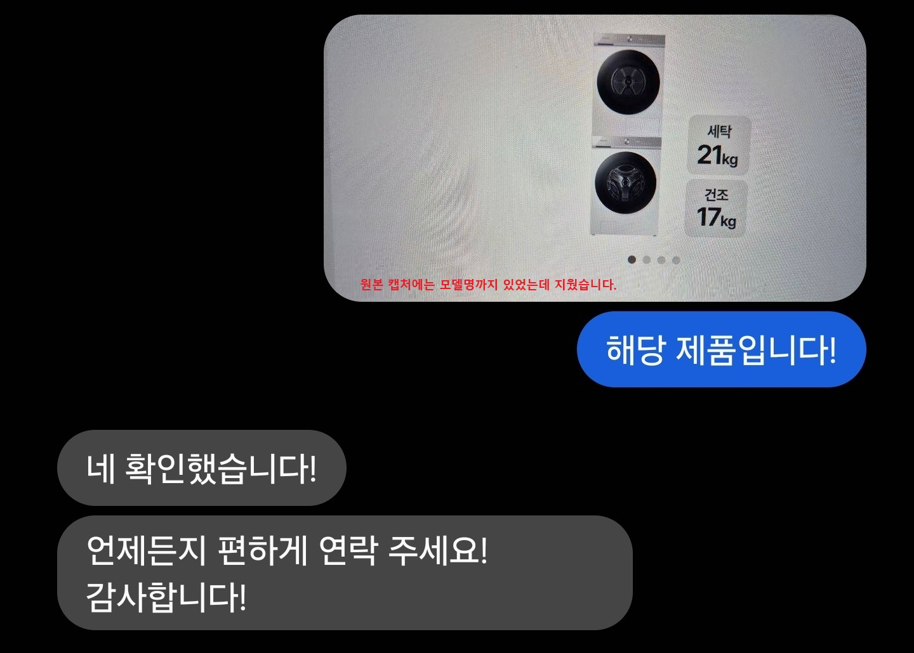
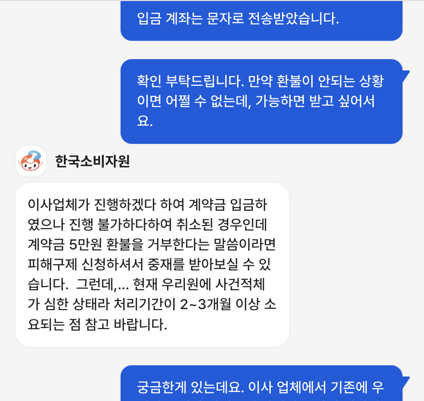
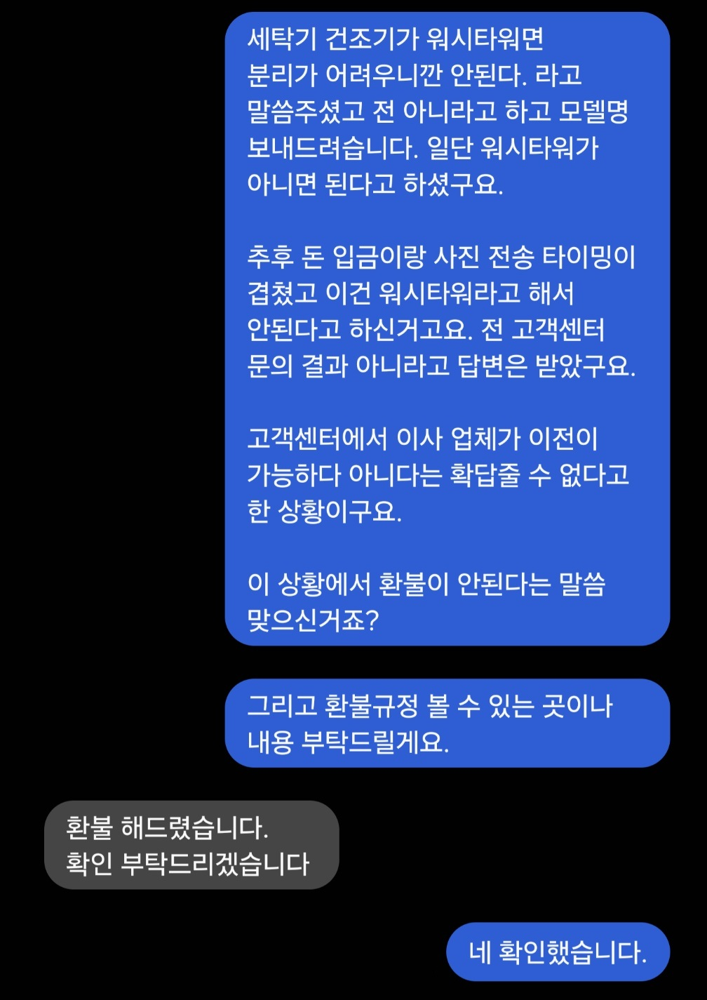

이사 업체 계약금 5만 원을 돌려받기까지 있었던 일을 정리해 둔다. 내가 옳고 업체가 틀렸다고 단정하기엔 애매한 부분도 있었기 때문에, 판단은 읽는 사람에게 맡긴다.

{/* AdSense: 본문 상단 광고 슬롯 예정 */}

## 상황 설명

업체 측에서 계약 전에 먼저 이런 안내를 했다. 세탁기 건조기가 워시타워 형태면 분리가 어려워 본인들이 진행하기 어렵고, 해당 브랜드에서 직접 해야 한다는 것이었다.

나는 워시타워가 아니라고 했고 모델명을 찾아서 보냈다. 업체는 워시타워가 아니면 진행할 수 있다고 했고, 며칠 뒤 계약을 진행했고 계약금을 입금했다.

계약 후 실물 사진을 보냈더니, 업체가 확인하고는 이건 워시타워여서 진행이 어렵다고 했다.

## 핵심은 이 부분

"모델명을 보냈을 때는 왜 아무 말이 없었냐"고 물었다. 당시 주고받은 문자는 이랬다.

그런데 업체의 답변은 이랬다.

> "그때는 찾아보지 않았다."

`확인했습니다`라고 해놓고, 나중에 찾아보지 않았다고 했다. 판단의 근거가 계속 바뀐 셈이었다.

## 환불 요청과 업체 입장

나는 진행이 불가능하다면 계약금을 돌려달라고 했다.

업체 측은 계약 전에 워시타워면 안 된다고 먼저 고지했고, **실제로 워시타워이기 때문에 환불해줄 수 없다**고 했다.

브랜드 고객센터에 직접 문의해서 워시타워가 아니라는 답변을 받았다고 전했다. 업체는 현장에서 오래 일한 경험상 자신이 맞다는 입장을 유지했다.

다만 고객센터 답변도 완전히 명확하지는 않았다. 제품 자체는 워시타워가 아니라고 했지만, 이사 업체가 작업 가능한지 여부는 본인들이 판단해줄 수 있는 영역이 아니라고 했다. 잘 하는 곳은 하고 못 하는 곳은 못 하는 거라는 식이었다.

{/* AdSense: 본문 중간 광고 슬롯 예정 */}

## 소비자원에 문의했다

업체와의 대화가 더 이상 진전이 없다고 판단해 한국소비자원 채팅 상담을 이용했다. 상황을 설명하고 환불이 가능한 경우인지 물었다.

소비자원의 답변 요지는 이랬다. `피해구제 신청`을 통해 중재를 받을 수는 있지만, 내가 취소하는 형태가 되면 환불 가능성이 낮아 보인다는 것이었다. 처리 기간도 2~3개월 이상 걸릴 수 있다고 했다.

지금 생각해보면 고객센터에 전화한 것 자체가 좀 웃기긴 하다. 이사 업체가 잘해서 잘하면 하는 거고 못 하면 못 하는 거지, 그걸 브랜드 고객센터에 물어봐서 뭘 어쩌려 했는지 모르겠다.

## 결과

업체에는 소비자원 문의 사실을 알리지 않았다. 대신 환불 규정을 확인하고 싶다고만 했다.

얼마 후 업체에서 환불해줬다는 문자가 왔다. **계약금 5만 원은 그날 돌아왔다.**

왜 갑자기 환불해줬는지는 모른다. 환불 규정 요청이 계기가 됐는지, 다른 이유가 있었는지는 알 수 없다.

이번 일을 계기로 계약금을 넣기 전에 좀 더 확실하게 확인해야겠다는 걸 배웠다. 모델명 보내고 된다고 하니 그냥 믿었는데, 그게 문제였다.

> 싸움이 길어질 것 같으면 소비자원에 먼저 상황을 물어보는 게 방향을 잡는 데 도움이 됐다.
