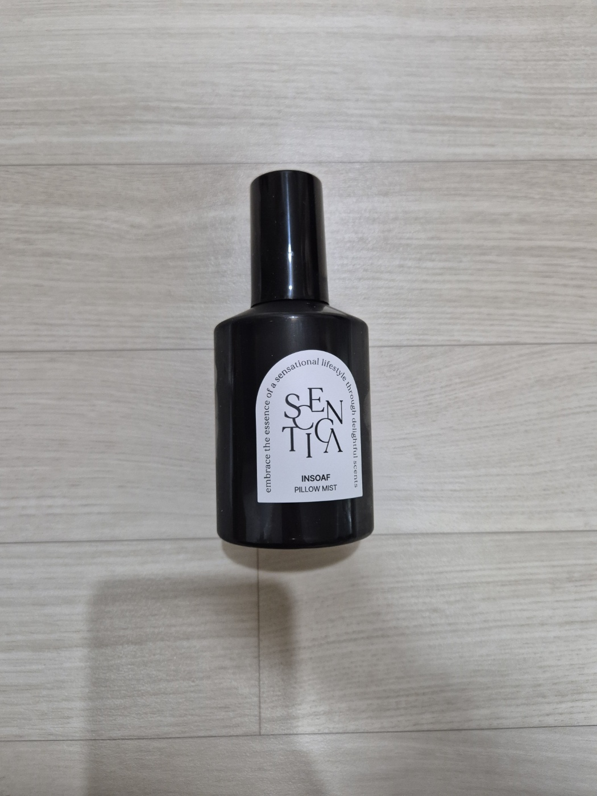

잠들기 전에 쓸 향을 하나 찾다가 `센티카 리추얼 필로우 미스트`를 봤다. 블랙 병에 흰 라벨 조합이 딱 과하지 않아서, 향보다 먼저 패키지가 눈에 들어왔다.

`인소프`, `마인드풀`, `캄우드` 3가지가 같이 보이니 더 단정했다. 밤에 쓰는 제품답게 분위기를 크게 흔들지 않는 쪽이라 **첫인상은 꽤 좋았다**.

<AdSlot slot="1406554779" className="my-6" />

## 센티카 리추얼 필로우 미스트 기본 정보

- 브랜드: `센티카`
- 제품군: `리추얼 필로우 미스트`
- 구성: `인소프`, `마인드풀`, `캄우드`
- 공식몰 기준 향 노트
  - `인소프`: 라벤더 | 패츌리 | 시더우드
  - `마인드풀`: 파인 | 라벤더 | 넛맥
  - `캄우드`: 레몬 | 샌달우드 | 바닐라

공식 설명도 전반적으로 비슷하다. 향을 세게 밀기보다, 잠들기 전에 공기를 정리하는 쪽에 더 가까운 느낌으로 보였다.

## 언박싱

박스는 생각보다 깔끔했다. **검은 병, 흰 라벨, 스플래터 무늬 박스** 조합이라 침실 옆에 둬도 튀지 않는다.

<Slideshow
  images={[
    {
      src: "./images/box-card.jpg",
      alt: "센티카 필로우 미스트 박스와 향 안내 카드가 함께 놓인 사진",
    },
    {
      src: "./images/lineup-pack.jpg",
      alt: "센티카 필로우 미스트 세 병과 상자가 나란히 놓인 사진",
    },
    {
      src: "./images/open-box.jpg",
      alt: "센티카 필로우 미스트 박스를 열어 내용물을 꺼낸 사진",
    },
  ]}
/>

## 써보면서 느낀 점

내 기준에서 제일 좋았던 건 **향의 방향이 다 다르다**는 점이었다. `인소프`는 가장 무난하고, `마인드풀`은 조금 더 초록 계열이 살아 있고, `캄우드`는 끝맛이 부드럽게 정리된다.

나는 베개에 바로 뿌리기보다, **잠들기 10분 전 침구 주변에 가볍게 뿌리는 쪽**이 더 잘 맞았다. 향이 부담스럽지 않아서 `루틴`처럼 쓰기 편했다.

사진처럼 디자인도 과한 장식이 없어서 좋았다. 향을 쓰는 제품인데도 시각적으로는 차분해서, **선물용으로도 무난해 보였다**.

## 한 줄 정리

향 자체보다 **잠들기 전 분위기를 정리하는 도구**에 가까운 제품이었다.

> 자극적인 향보다 조용한 향을 찾는다면 꽤 잘 맞는다.
