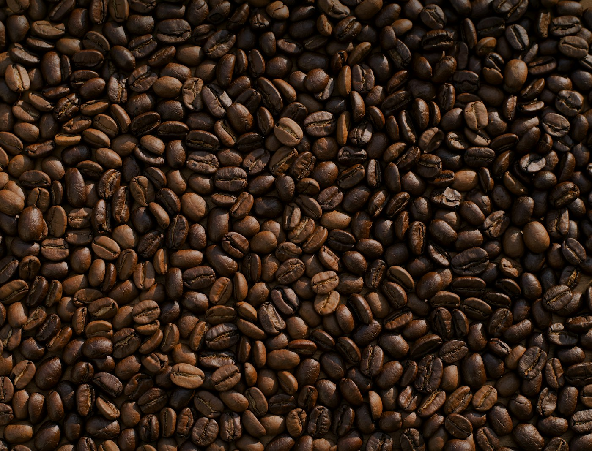

알람을 꺼 두고 잤다. 눈을 떠 보니 11시. 평소 같으면 죄책감이 들었을 텐데, 오늘은 그냥 그러기로 한 날이라 마음이 편했다.

천천히 씻고, 동네 카페로 걸어갔다. 첫 잔은 자리에서, 두 번째 잔은 산책하며.

## 오늘 한 것

1. 늦잠
2. 동네 한 바퀴
3. 커피 두 잔
4. 그리고 아무것도

## 원두 한 봉지

카페에서 원두도 한 봉지 샀다. 집에서 내려 마시려고. 봉투를 열 때 나는 냄새가 좋아서, 사실 이게 목적이었던 것 같기도 하다.

> 가끔은 계획 없는 하루가 제일 잘 쉰 하루다. 다음 주에도 한 번쯤은 이러기로.
