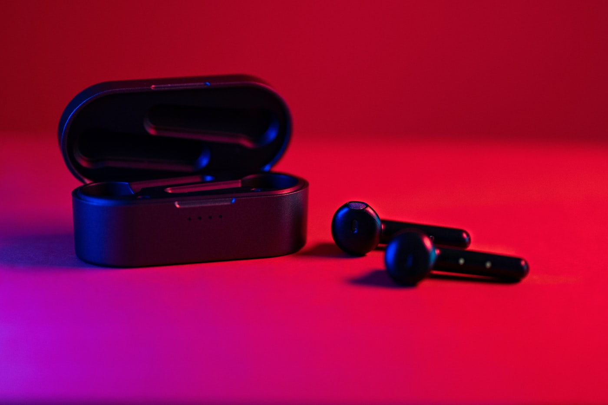

지하철에서 한쪽을 흘렸다. 한 달을 한쪽으로만 버티다가 결국 새로 샀다. 이왕 다시 사는 거, 다른 브랜드도 비교해 봤는데 결국 쓰던 걸로 돌아왔다.

## 다시 같은 걸 고른 이유

- **연결이 빠르다**: 케이스 열면 1초 안에 잡힌다. 이게 매일 쓰면 생각보다 큰 차이다.
- **케이스가 주머니에 딱**: 작고 가벼워서 어디든 그냥 넣고 다니게 된다.

## 두 번째라 보인 단점

처음 살 땐 안 보였는데, 잘 잃어버린다. 너무 작고 가벼워서다. 이번엔 케이스에 고리를 달아 가방에 묶어 두기로 했다.

> 분실 방지 기능(찾기)이 되는지 꼭 확인하고 살 것. 한 번 잃어 보면 이게 제일 중요해진다.

## 결론

성능은 여전히 만족. 단점은 제품이 아니라 내 부주의 쪽이었다. 이번엔 안 잃어버리는 게 목표.
